<div align="center">


`Windows` [`Lively Wallpaper`](https://github.com/lively-community/lively) `WebGL` `Canvas` `HTML` `Live Wallpaper` - Custom live wallpapers for Lively Wallpaper on Windows: plain HTML pages that draw on the GPU, each with its own settings panel. Widget counterpart: [Ringmast4r/Rainmeter](https://github.com/Ringmast4r/Rainmeter)

[](https://git.io/typing-svg)


<br>

[](#the-wallpapers)
[](#community)
[](https://github.com/lively-community/lively)
[](#how-a-wallpaper-is-built)
[](#license)

[](https://github.com/Ringmast4r/Lively-Wallpapers/stargazers)
[](https://github.com/Ringmast4r/Lively-Wallpapers/network/members)
[](#)
[](https://github.com/Ringmast4r/Lively-Wallpapers/commits/main)
[](#)

</div>

---

<a id="what-is-this"></a>
## `> what_is_this`

```bash
you@github:~$ cat lively-wallpapers.txt

  PURPOSE:        Live wallpapers we made for our own desktops, shared,
                  plus 85 by other people that we run and recommend
  HOST:           Lively Wallpaper (free, open source, Windows 10 and 11)
  FORMAT:         One folder per wallpaper: index.html + two small JSON files
  NETWORK:        Ours: none, fonts and data ship in the folder.
                  Some community ones fetch weather, fonts or live imagery
  RIGHTS:         Ours: proprietary to Net Works Lab LLC. Free to run, not to redistribute.
                  Community: each under its author's own licence, credited
  STATUS:         [ ACTIVE ]
```

> Windows has no live wallpaper of its own. [Lively Wallpaper](https://github.com/lively-community/lively) fills that gap by running a web page behind your desktop icons, and these are the pages.

Every picture in this README is the wallpaper itself, recorded by stepping the real page frame by frame (`scripts/shoot.py`). None of it is a mock-up. The community previews are the authors' own, or recorded from the running page.

---

<a id="the-wallpapers"></a>
## `> ls wallpapers/`

| | Wallpaper | What it is | Get it |
|:--|:--|:--|:--|
|  | **[Net Works Globe](#net-works-globe)** | A black and white low-polygon world turning inside two orbit rings. | [`networks-globe.zip`](https://github.com/Ringmast4r/Lively-Wallpapers/raw/main/packages/networks-globe.zip) |
|  | **[Pumpkin Globe](#pumpkin-globe)** | The globe as a pumpkin with a carved face, flat or as a lit jack-o'-lantern. | [`pumpkin-globe.zip`](https://github.com/Ringmast4r/Lively-Wallpapers/raw/main/packages/pumpkin-globe.zip) |
|  | **[Moon](#moon)** | The real lunar surface turning under a fixed light, craters and all. | [`moon.zip`](https://github.com/Ringmast4r/Lively-Wallpapers/raw/main/packages/moon.zip) |
|  | **[Dot Matrix Globe](#dot-matrix-globe)** | No outlines: the continents as a lattice of dots that fade toward the limb. | [`dot-matrix-globe.zip`](https://github.com/Ringmast4r/Lively-Wallpapers/raw/main/packages/dot-matrix-globe.zip) |
|  | **[Great Circles](#great-circles)** | Routes between cities arcing over a quiet dotted globe, each carrying a pulse. | [`great-circles.zip`](https://github.com/Ringmast4r/Lively-Wallpapers/raw/main/packages/great-circles.zip) |
|  | **[Engraved Globe](#engraved-globe)** | Continents ruled out of parallels, the way a banknote builds a shape. | [`engraved-globe.zip`](https://github.com/Ringmast4r/Lively-Wallpapers/raw/main/packages/engraved-globe.zip) |
|  | **[Rabbit Hole](#rabbit-hole)** | A girl falling down a well lined with shelves, maps and cupboards, forever. | [`rabbit-hole.zip`](https://github.com/Ringmast4r/Lively-Wallpapers/raw/main/packages/rabbit-hole.zip) |

**Settings every wallpaper has** (right click the wallpaper in Lively, then Customise):

| Setting | Default | What it does |
|:--|:--|:--|
| Speed | `40` | Percent of full pace. `100` is one turn in 14 seconds; `40` is one in 35. `0` stops it, and a stopped wallpaper stops drawing. |
| Theme | Dark | Dark is ink on black, Light is ink on paper. |
| Corner wordmark | on | `NET // WORKS` bottom left and the line bottom right. |
| Right corner text | `NET-WORKS-LAB.COM` | Put anything you like there, or clear it. |

**Any screen.** Each one is sized from the shorter side of the monitor and drawn at the monitor's real pixel count, including at 125% and 150% Windows scaling. On screens wider than 16:9 the wordmark keeps to a centred 16:9 frame, so a taskbar docked to the side does not cover it.

<a id="community"></a>
### `> ls community/`

Eighty-five more, made by other people, that we tried on our own desktops and kept. Every row names its author and licence.

- **57 are in this repo**, one folder each under [`community/`](community/), with the author's licence file beside the wallpaper and a `SOURCE.md` saying where it came from and what, if anything, we changed. Their zips are on the [community release](https://github.com/Ringmast4r/Lively-Wallpapers/releases/tag/community); install them the same way as ours.
- **28 are links.** Their authors gave no licence, or one that rules out sharing, so the files stay with them and the row takes you to the author's repo.

None of these are Net Works work, and our LICENSE does not cover them. If one is yours and you would like it credited differently or taken out, open an issue.

#### Space and globes

| | Wallpaper | What it is | Get it |
|:--|:--|:--|:--|
| 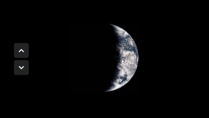 | **[Realtime Globe](community/tsungmnli-realtime-globe/)** | The real Earth as the Himawari-9 satellite sees it now, refreshed through the day.<br><sub>by Jongmin Lee · MIT</sub> | [`tsungmnli-realtime-globe.zip`](https://github.com/Ringmast4r/Lively-Wallpapers/releases/download/community/tsungmnli-realtime-globe.zip) |
| 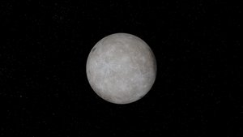 | **[Live Earth and Moon](https://github.com/neymar-santo-10/Earth-MoonDynamicWallpaper)** | Earth and Moon in their real positions, with live clouds over the Earth.<br><sub>by neymar-santo-10 · no licence</sub> | [author's repo](https://github.com/neymar-santo-10/Earth-MoonDynamicWallpaper) |
| 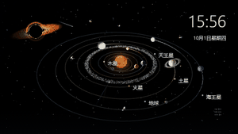 | **[Between Planets](community/nerdless-between-planets/)** | An interactive 3D solar system with a clock, fully offline.<br><sub>by 张凌康 · MIT</sub> | [`nerdless-between-planets.zip`](https://github.com/Ringmast4r/Lively-Wallpapers/releases/download/community/nerdless-between-planets.zip) |
| 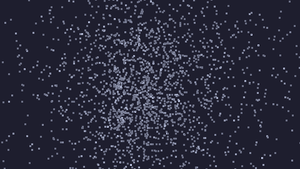 | **[Planetarium](community/camblomquist-planetarium/)** | A slow-turning sky of stars, drawn in Three.js.<br><sub>by camblomquist · MIT</sub> | [`camblomquist-planetarium.zip`](https://github.com/Ringmast4r/Lively-Wallpapers/releases/download/community/camblomquist-planetarium.zip) |
| 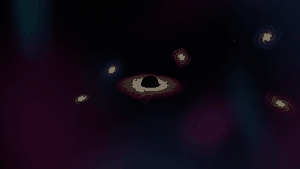 | **[Universe](community/bzvzn-universe/)** | Galaxies, nebulae and a black hole drifting through deep space.<br><sub>by Bzvzn · MIT</sub> | [`bzvzn-universe.zip`](https://github.com/Ringmast4r/Lively-Wallpapers/releases/download/community/bzvzn-universe.zip) |
| 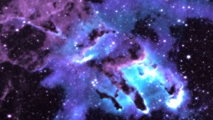 | **[Pillars of Creation](https://github.com/notash23/pillarofcreation-wallpaper/releases/tag/v0.1.0)** | The Pillars of Creation nebula, glowing and slowly shifting.<br><sub>by notash23 · no licence</sub> | [author's repo](https://github.com/notash23/pillarofcreation-wallpaper/releases/tag/v0.1.0) |
| 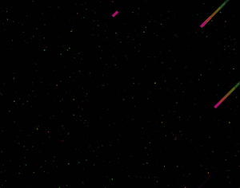 | **[Comets](community/toughboli-comets/)** | Bright comet trails crossing a dark sky on the diagonal.<br><sub>by Jayden Jayawardhena · MIT</sub> | [`toughboli-comets.zip`](https://github.com/Ringmast4r/Lively-Wallpapers/releases/download/community/toughboli-comets.zip) |
|  | **[StarLine](https://github.com/RanR112/StarLine)** | A quiet field of drifting stars.<br><sub>by RanR112 · no licence</sub> | [author's repo](https://github.com/RanR112/StarLine) |
|  | **[Gravity's Dark Abyss](https://github.com/dhruvin-sarkar/Win11-Rice-Ash/tree/main/Lively/32e44vok.s0z)** | A black hole's accretion spiral turning in the dark (video).<br><sub>by shared by dhruvin-sarkar · unclear (video of unknown origin)</sub> | [author's repo](https://github.com/dhruvin-sarkar/Win11-Rice-Ash/tree/main/Lively/32e44vok.s0z) |

#### Scenes and weather

| | Wallpaper | What it is | Get it |
|:--|:--|:--|:--|
|  | **[Snow](community/rocksdanister-snow/)** | Snow falling past a misty mountain, as if behind a window.<br><sub>by Rocksdanister · CC BY-NC-SA 3.0</sub> | [`rocksdanister-snow.zip`](https://github.com/Ringmast4r/Lively-Wallpapers/releases/download/community/rocksdanister-snow.zip) |
| 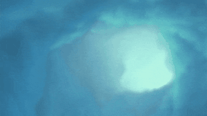 | **[Clouds](community/rocksdanister-clouds/)** | A sky of slow volumetric clouds, colours to taste.<br><sub>by Rocksdanister · CC BY-NC-SA 3.0</sub> | [`rocksdanister-clouds.zip`](https://github.com/Ringmast4r/Lively-Wallpapers/releases/download/community/rocksdanister-clouds.zip) |
| 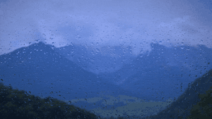 | **[Raindash](community/helloworld3200-raindash/)** | Rocksdanister's rainy window with a clock, greeting and system stats on the glass.<br><sub>by helloworld3200 and Rocksdanister · CC BY-NC-SA 3.0</sub> | [`helloworld3200-raindash.zip`](https://github.com/Ringmast4r/Lively-Wallpapers/releases/download/community/helloworld3200-raindash.zip) |
| 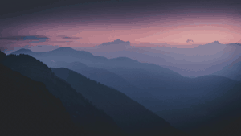 | **[Misty Ridges (AI depth)](community/rocksdanister-misty-ridges-depth/)** | Layered ridges at dusk that shift in 3D as the mouse moves, from Lively's own depth model.<br><sub>by Rocksdanister (template), photo by cmonphotography · MIT</sub> | [`rocksdanister-misty-ridges-depth.zip`](https://github.com/Ringmast4r/Lively-Wallpapers/releases/download/community/rocksdanister-misty-ridges-depth.zip) |
|  | **[My Dear Panda](community/hamidtech-my-dear-panda/)** | A panda asleep on a moonlit shore, with depth parallax.<br><sub>by hamidtech · MIT</sub> | [`hamidtech-my-dear-panda.zip`](https://github.com/Ringmast4r/Lively-Wallpapers/releases/download/community/hamidtech-my-dear-panda.zip) |
| 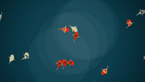 | **[Koi Pond](community/rzrabbi-koi-pond/)** | Koi gliding through a teal pond and scattering from the cursor.<br><sub>by Rezaye Rabbi · MIT</sub> | [`rzrabbi-koi-pond.zip`](https://github.com/Ringmast4r/Lively-Wallpapers/releases/download/community/rzrabbi-koi-pond.zip) |
|  | **[AnthroFox](community/mezum-anthrofox/)** | A fox wanderer on a boardwalk through the woods, the season changing with the date.<br><sub>by Kitsunesaki Mezumona · MIT</sub> | [`mezum-anthrofox.zip`](https://github.com/Ringmast4r/Lively-Wallpapers/releases/download/community/mezum-anthrofox.zip) |
| 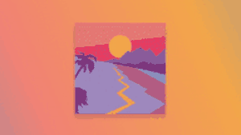 | **[First Light](community/meokisama-first-light/)** | A flat-colour road winding into the mountains at dawn.<br><sub>by Adam Kuhn · MIT</sub> | [`meokisama-first-light.zip`](https://github.com/Ringmast4r/Lively-Wallpapers/releases/download/community/meokisama-first-light.zip) |
| 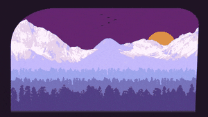 | **[Roadside Sunset](community/meokisama-roadside-sunset/)** | A flat-colour mountain range with birds crossing the sun.<br><sub>by Alex Trost · MIT</sub> | [`meokisama-roadside-sunset.zip`](https://github.com/Ringmast4r/Lively-Wallpapers/releases/download/community/meokisama-roadside-sunset.zip) |
| 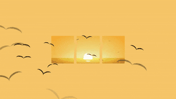 | **[Sunset Birds](community/meokisama-sunset-birds/)** | Birds crossing three panes of orange evening sky.<br><sub>by Yusuke Nakaya · MIT</sub> | [`meokisama-sunset-birds.zip`](https://github.com/Ringmast4r/Lively-Wallpapers/releases/download/community/meokisama-sunset-birds.zip) |
|  | **[25th Hour Dynamic](https://github.com/Ju1-js/25th-hour-dynamic/tree/main/Dynamic)** | A lakeside forest that follows the time of day, from dawn to starlight.<br><sub>by Ju1-js, after Louis Coyle · art unlicensed</sub> | [author's repo](https://github.com/Ju1-js/25th-hour-dynamic/tree/main/Dynamic) |
|  | **[Lighthouse](https://github.com/wizzywusky/Lighthouse-Wallpaper)** | A lighthouse sweeping its beam over the sea, with a clock.<br><sub>by wizzywusky · no licence</sub> | [author's repo](https://github.com/wizzywusky/Lighthouse-Wallpaper) |
|  | **[Starry Night](https://github.com/Firpis/lively-wallpaper-sternennacht)** | Van Gogh's Starry Night pulled apart into parallax layers.<br><sub>by Firpis · no licence for the code</sub> | [author's repo](https://github.com/Firpis/lively-wallpaper-sternennacht) |
|  | **[The Great Wave](https://github.com/meokisama/Lively-Wallpaper/tree/master/The%20Great%20Wave)** | Hokusai's Great Wave with a clock and the weather.<br><sub>by meokisama · no licence for the code</sub> | [author's repo](https://github.com/meokisama/Lively-Wallpaper/tree/master/The%20Great%20Wave) |
|  | **[4K Waves](https://github.com/djdiox/4K-Waves-Lively-Wallpaper)** | Surf breaking over dark rocks, filmed from above (video).<br><sub>by djdiox · no licence</sub> | [author's repo](https://github.com/djdiox/4K-Waves-Lively-Wallpaper) |
| 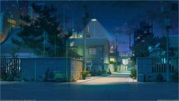 | **[Eduh Rain](https://github.com/eduhdev12/rain-lively-wallpaper)** | Rain over a quiet painted street at dusk.<br><sub>by eduhdev12 · no licence</sub> | [author's repo](https://github.com/eduhdev12/rain-lively-wallpaper) |
| 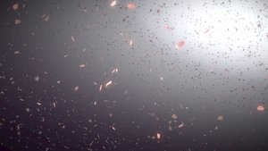 | **[Sakura](https://github.com/ekoputrapratama/lively-sakura)** | Cherry blossom petals drifting through soft light.<br><sub>by ekoputrapratama · no licence</sub> | [author's repo](https://github.com/ekoputrapratama/lively-sakura) |
|  | **[Alve's Town](https://github.com/Gabrz/lively-alve)** | A pixel-art town with the time on its billboard.<br><sub>by Gabrz · no licence</sub> | [author's repo](https://github.com/Gabrz/lively-alve) |
| 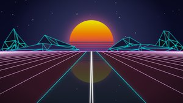 | **[Vaporwave Road](https://github.com/Space-Cadet-Stuff/Outrun-Wallpaper-for-Lively-Wallpaper)** | An endless synthwave road running toward a striped sun.<br><sub>by Space-Cadet-Stuff · no licence</sub> | [author's repo](https://github.com/Space-Cadet-Stuff/Outrun-Wallpaper-for-Lively-Wallpaper) |

#### Clocks and dashboards

| | Wallpaper | What it is | Get it |
|:--|:--|:--|:--|
| 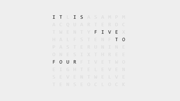 | **[Text Clock](community/ob-julian-text-clock/)** | IT IS QUARTER PAST THREE, lit up in a grid of letters.<br><sub>by ob-julian · GPL-3.0</sub> | [`ob-julian-text-clock.zip`](https://github.com/Ringmast4r/Lively-Wallpapers/releases/download/community/ob-julian-text-clock.zip) |
| 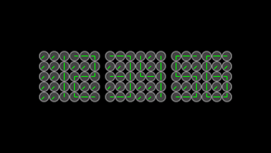 | **[Clock of Clocks](community/flufiku-clock-of-clocks/)** | The time spelled out by dozens of little analog clocks turning in step.<br><sub>by Flufiku · AGPL-3.0</sub> | [`flufiku-clock-of-clocks.zip`](https://github.com/Ringmast4r/Lively-Wallpapers/releases/download/community/flufiku-clock-of-clocks.zip) |
|  | **[Clock (Часы)](community/projectsoft-clock/)** | A bold analog clock over a black and white sculpture.<br><sub>by ProjectSoft · MIT</sub> | [`projectsoft-clock.zip`](https://github.com/Ringmast4r/Lively-Wallpapers/releases/download/community/projectsoft-clock.zip) |
| 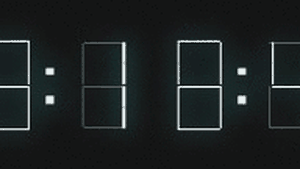 | **[Digital Clock](community/meokisama-digital-clock/)** | Huge glowing digits over a city at sunset.<br><sub>by David Khourshid · MIT</sub> | [`meokisama-digital-clock.zip`](https://github.com/Ringmast4r/Lively-Wallpapers/releases/download/community/meokisama-digital-clock.zip) |
| 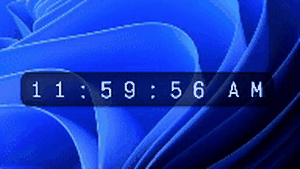 | **[Animated Clock](community/den4md-animated-clock/)** | Rolling digits in a glass bar on a blue-to-violet gradient.<br><sub>by Denis Staritin · MIT</sub> | [`den4md-animated-clock.zip`](https://github.com/Ringmast4r/Lively-Wallpapers/releases/download/community/den4md-animated-clock.zip) |
|  | **[Alternate Analog Clock](https://github.com/izeau/uptime)** | A minimal analog clock on red.<br><sub>by izeau · no licence</sub> | [author's repo](https://github.com/izeau/uptime) |
| 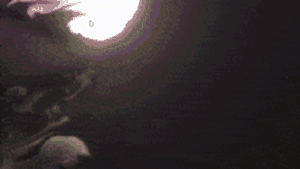 | **[Fluids Clock](community/robotism-fluids-clock/)** | Fluid simulation swirling behind a solar-system clock face.<br><sub>by robotism, fluid by Pavel Dobryakov · MIT</sub> | [`robotism-fluids-clock.zip`](https://github.com/Ringmast4r/Lively-Wallpapers/releases/download/community/robotism-fluids-clock.zip) |
| 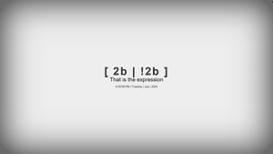 | **[2b \| !2b](community/civermau-2b-or-not-2b/)** | To be or not to be, as a boolean, over a clock on soft grey.<br><sub>by Civermau · CC BY-NC-SA 4.0</sub> | [`civermau-2b-or-not-2b.zip`](https://github.com/Ringmast4r/Lively-Wallpapers/releases/download/community/civermau-2b-or-not-2b.zip) |
| 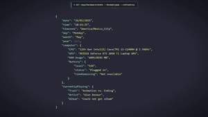 | **[Json System Stats](community/civermau-json-system-stats/)** | Date, time and live CPU, GPU and RAM, printed as a JSON response.<br><sub>by Civermau · CC BY-NC-SA 4.0</sub> | [`civermau-json-system-stats.zip`](https://github.com/Ringmast4r/Lively-Wallpapers/releases/download/community/civermau-json-system-stats.zip) |
| 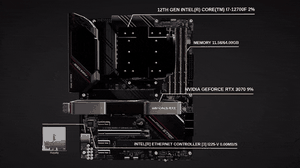 | **[Simple System 3D](community/rocksdanister-simple-system-3d/)** | A PC on a turntable, labelled with live CPU, GPU, RAM and network.<br><sub>by Rocksdanister · MIT</sub> | [`rocksdanister-simple-system-3d.zip`](https://github.com/Ringmast4r/Lively-Wallpapers/releases/download/community/rocksdanister-simple-system-3d.zip) |
|  | **[System Dials](https://github.com/NatromeTex/System-Dials)** | CPU, GPU and RAM as three gauge dials.<br><sub>by NatromeTex · no licence</sub> | [author's repo](https://github.com/NatromeTex/System-Dials) |
| 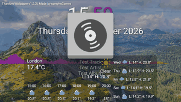 | **[Titanium](community/coreyhsgames-titanium/)** | A mountain photo with clock, now playing, audio bars and a week of weather.<br><sub>by coreyhsGames · MIT</sub> | [`coreyhsgames-titanium.zip`](https://github.com/Ringmast4r/Lively-Wallpapers/releases/download/community/coreyhsgames-titanium.zip) |
| 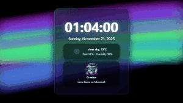 | **[Lively Gradient Ribbons](community/brkee-gradient-ribbons/)** | Neon ribbons sweeping behind a glass card with the time and what is playing.<br><sub>by Berk Ege (brkee) · FUL-BYSA 1.0</sub> | [`brkee-gradient-ribbons.zip`](https://github.com/Ringmast4r/Lively-Wallpapers/releases/download/community/brkee-gradient-ribbons.zip) |
| 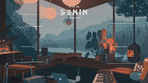 | **[White Oak](community/sukundev-white-oak/)** | A cosy lofi cabin with a big clock and system stats.<br><sub>by SukunDev · MIT</sub> | [`sukundev-white-oak.zip`](https://github.com/Ringmast4r/Lively-Wallpapers/releases/download/community/sukundev-white-oak.zip) |
|  | **[Aurora Desk](https://github.com/sirajju/lively-wallpaper)** | A glass dashboard: clock, quote, weather, calendar and a pomodoro timer.<br><sub>by sirajju · no licence</sub> | [author's repo](https://github.com/sirajju/lively-wallpaper) |
| 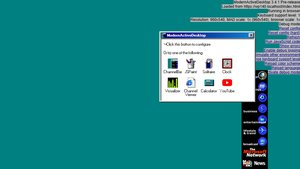 | **[Windows 98 Desktop Experience](https://github.com/Ingan121/ModernActiveDesktop)** | Active Desktop is back: a teal Windows 98 desktop with the channel bar and widgets.<br><sub>by Ingan121 · MIT, except Microsoft's Windows 98 files</sub> | [author's repo](https://github.com/Ingan121/ModernActiveDesktop) |

#### Music visualizers

| | Wallpaper | What it is | Get it |
|:--|:--|:--|:--|
| 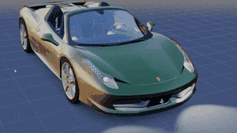 | **[Ferrari 458 Italia](community/rocksdanister-ferrari-458/)** | A red Ferrari on a turntable that pulses with the music.<br><sub>by Rocksdanister, model by vicent091036 · MIT</sub> | [`rocksdanister-ferrari-458.zip`](https://github.com/Ringmast4r/Lively-Wallpapers/releases/download/community/rocksdanister-ferrari-458.zip) |
| 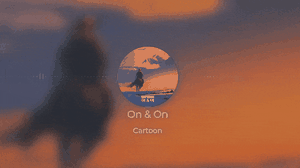 | **[Media Parallax](community/rocksdanister-media-parallax/)** | A spinning record carrying the current track's cover and title.<br><sub>by Rocksdanister · MIT</sub> | [`rocksdanister-media-parallax.zip`](https://github.com/Ringmast4r/Lively-Wallpapers/releases/download/community/rocksdanister-media-parallax.zip) |
| 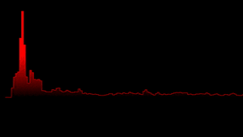 | **[Simple Visualizer](community/rocksdanister-simple-visualizer/)** | Red frequency bars on black.<br><sub>by Rocksdanister · MIT</sub> | [`rocksdanister-simple-visualizer.zip`](https://github.com/Ringmast4r/Lively-Wallpapers/releases/download/community/rocksdanister-simple-visualizer.zip) |
| 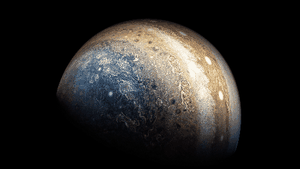 | **[Album Art](community/alexberkowitz-album-art/)** | The cover of whatever is playing, large on black; Jupiter when nothing is.<br><sub>by Alex Berkowitz, after Rocksdanister · MIT</sub> | [`alexberkowitz-album-art.zip`](https://github.com/Ringmast4r/Lively-Wallpapers/releases/download/community/alexberkowitz-album-art.zip) |
| 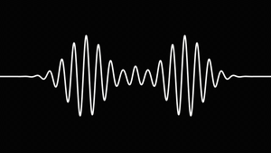 | **[AM Audio Visualizer](community/sans-script-am-visualizer/)** | One white sound wave on black that moves with the music.<br><sub>by Alexandre Santos · MIT</sub> | [`sans-script-am-visualizer.zip`](https://github.com/Ringmast4r/Lively-Wallpapers/releases/download/community/sans-script-am-visualizer.zip) |
| 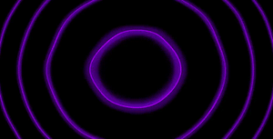 | **[Musifyze Visualizer](community/xephosbot-musifyze/)** | Glowing purple rings that ripple to the music.<br><sub>by xephosbot · MIT</sub> | [`xephosbot-musifyze.zip`](https://github.com/Ringmast4r/Lively-Wallpapers/releases/download/community/xephosbot-musifyze.zip) |
| 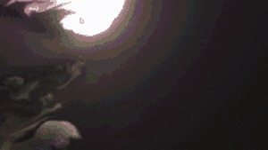 | **[Fluids v2](community/meokisama-fluids-v2/)** | The WebGL fluid simulation, splashing in time with the music.<br><sub>by Pavel Dobryakov · MIT</sub> | [`meokisama-fluids-v2.zip`](https://github.com/Ringmast4r/Lively-Wallpapers/releases/download/community/meokisama-fluids-v2.zip) |
|  | **[Circle Audio Visualizer](https://github.com/eliasfloreteng/lively-audio-visualizer)** | A ring of bars pulsing over a misty forest.<br><sub>by Elias Floreteng · no licence</sub> | [author's repo](https://github.com/eliasfloreteng/lively-audio-visualizer) |
| 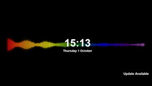 | **[Ray Music Visualizer](https://github.com/Aprotonix/Rainbow-Music-Visualizer-Wallpaper)** | Rainbow audio bars around the clock and date.<br><sub>by Aprotonix · no licence</sub> | [author's repo](https://github.com/Aprotonix/Rainbow-Music-Visualizer-Wallpaper) |
|  | **[Clean Audio](https://github.com/MiroloTech/CleanAudio)** | A smooth waveform under the current track.<br><sub>by MiroloTech · no licence</sub> | [author's repo](https://github.com/MiroloTech/CleanAudio) |
| 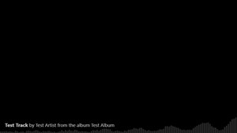 | **[Minimalistic](https://github.com/nodeblox/lively-minimalistic)** | Black, with the current track and a thin visualizer along the bottom.<br><sub>by nodeblox · no licence</sub> | [author's repo](https://github.com/nodeblox/lively-minimalistic) |
|  | **[Musically](https://github.com/CorruptedFile2021/Musically-Wallpaper/tree/main/Musically)** | Now playing in a frame on a starry night.<br><sub>by CorruptedFile2021 · no licence</sub> | [author's repo](https://github.com/CorruptedFile2021/Musically-Wallpaper/tree/main/Musically) |

#### Patterns and effects

| | Wallpaper | What it is | Get it |
|:--|:--|:--|:--|
| 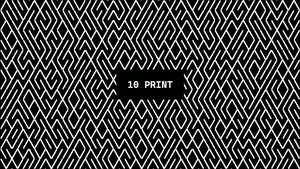 | **[Print Pattern](community/ottozumkeller-10-print/)** | The classic 10 PRINT maze, redrawn in black and white.<br><sub>by ottozumkeller · MIT</sub> | [`ottozumkeller-10-print.zip`](https://github.com/Ringmast4r/Lively-Wallpapers/releases/download/community/ottozumkeller-10-print.zip) |
| 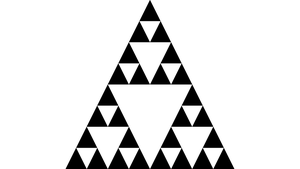 | **[Fractalizer](community/flufiku-fractalizer/)** | Sierpinski triangles and other fractals in black and white.<br><sub>by Flufiku · AGPL-3.0</sub> | [`flufiku-fractalizer.zip`](https://github.com/Ringmast4r/Lively-Wallpapers/releases/download/community/flufiku-fractalizer.zip) |
| 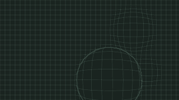 | **[Grid Wallpaper](community/gagexhill-grid/)** | A quiet dark grid that ripples where the cursor goes.<br><sub>by gagexhill · MIT</sub> | [`gagexhill-grid.zip`](https://github.com/Ringmast4r/Lively-Wallpapers/releases/download/community/gagexhill-grid.zip) |
| 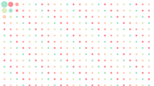 | **[Lively Dots](community/realcyguy-lively-dots/)** | A grid of pastel dots that scatter from the cursor.<br><sub>by Cyrus Yip · MIT</sub> | [`realcyguy-lively-dots.zip`](https://github.com/Ringmast4r/Lively-Wallpapers/releases/download/community/realcyguy-lively-dots.zip) |
| 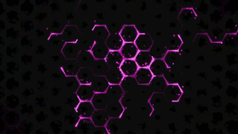 | **[Neon Hexagons](community/realcyguy-neon-hexagons/)** | Red sparks that wander until they settle into a neon hexagon lattice.<br><sub>by Cyrus Yip · MIT</sub> | [`realcyguy-neon-hexagons.zip`](https://github.com/Ringmast4r/Lively-Wallpapers/releases/download/community/realcyguy-neon-hexagons.zip) |
| 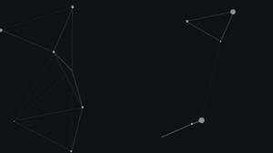 | **[Particles](community/mcshoothy-particles/)** | The particles.js constellation, joining up the dots near the cursor.<br><sub>by McShoothy, particles.js by Vincent Garreau · MIT</sub> | [`mcshoothy-particles.zip`](https://github.com/Ringmast4r/Lively-Wallpapers/releases/download/community/mcshoothy-particles.zip) |
| 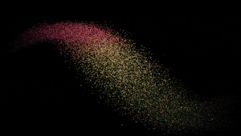 | **[Particle Stream](community/meokisama-particle-stream/)** | A ribbon of coloured particles flowing across black.<br><sub>by Szenia Zadvornykh · MIT</sub> | [`meokisama-particle-stream.zip`](https://github.com/Ringmast4r/Lively-Wallpapers/releases/download/community/meokisama-particle-stream.zip) |
| 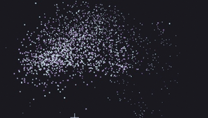 | **[Attractive Particles](community/meokisama-attractive-particles/)** | A field of tiny stars pulled toward the cursor.<br><sub>by George (gmihalios) · MIT</sub> | [`meokisama-attractive-particles.zip`](https://github.com/Ringmast4r/Lively-Wallpapers/releases/download/community/meokisama-attractive-particles.zip) |
| 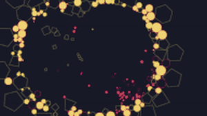 | **[Attractor [Dark]](community/meokisama-attractor-dark/)** | Bright circles and polygons swarming on navy.<br><sub>by Marco Dell'Anna · MIT</sub> | [`meokisama-attractor-dark.zip`](https://github.com/Ringmast4r/Lively-Wallpapers/releases/download/community/meokisama-attractor-dark.zip) |
| 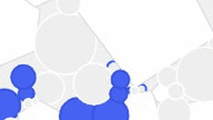 | **[Attractor](community/meokisama-attractor/)** | The same swarm, on white.<br><sub>by Marco Dell'Anna · MIT</sub> | [`meokisama-attractor.zip`](https://github.com/Ringmast4r/Lively-Wallpapers/releases/download/community/meokisama-attractor.zip) |
| 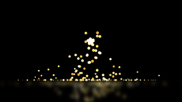 | **[Sparks](community/meokisama-sparks/)** | A fountain of golden sparks over dark water.<br><sub>by Bennett Waisbren · MIT</sub> | [`meokisama-sparks.zip`](https://github.com/Ringmast4r/Lively-Wallpapers/releases/download/community/meokisama-sparks.zip) |
| 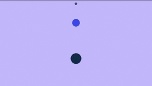 | **[Detour](community/meokisama-detour/)** | Dots tracing a winding detour on lilac.<br><sub>by Tiffany Rayside · MIT</sub> | [`meokisama-detour.zip`](https://github.com/Ringmast4r/Lively-Wallpapers/releases/download/community/meokisama-detour.zip) |
|  | **[Ribbon](community/boris-sehovac-ribbon/)** | One glossy blue ribbon folding slowly through the dark.<br><sub>by Boris Šehovac · MIT</sub> | [`boris-sehovac-ribbon.zip`](https://github.com/Ringmast4r/Lively-Wallpapers/releases/download/community/boris-sehovac-ribbon.zip) |
|  | **[Waves](community/vanta-waves/)** | A low-poly blue sea rolling under the cursor.<br><sub>by Teng Bao (Vanta.js) · MIT</sub> | [`vanta-waves.zip`](https://github.com/Ringmast4r/Lively-Wallpapers/releases/download/community/vanta-waves.zip) |
|  | **[Iris](community/crisiswastaken-iris/)** | A pair of red eyes in the dark that follow your cursor.<br><sub>by Crisiswastaken · MIT</sub> | [`crisiswastaken-iris.zip`](https://github.com/Ringmast4r/Lively-Wallpapers/releases/download/community/crisiswastaken-iris.zip) |
|  | **[Infinite Desktop](community/rocksdanister-infinite-desktop/)** | Your own desktop mirrored into itself, forever. A small Windows app, rebuilt here with a memory leak fixed.<br><sub>by Rocksdanister · MIT</sub> | [`rocksdanister-infinite-desktop.zip`](https://github.com/Ringmast4r/Lively-Wallpapers/releases/download/community/rocksdanister-infinite-desktop.zip) |
|  | **[Infinite Tubes: Particles](https://github.com/meokisama/Lively-Wallpaper/tree/master/Infinite%20Tubes)** | Flying down an endless tunnel of particles.<br><sub>by Louis Hoebregts (Codrops) · Codrops licence, no redistribution</sub> | [author's repo](https://github.com/meokisama/Lively-Wallpaper/tree/master/Infinite%20Tubes) |
|  | **[Infinite Tubes: Triangle](https://github.com/meokisama/Lively-Wallpaper/tree/master/Infinite%20Tubes)** | Flying down an endless tunnel of triangles.<br><sub>by Louis Hoebregts (Codrops) · Codrops licence, no redistribution</sub> | [author's repo](https://github.com/meokisama/Lively-Wallpaper/tree/master/Infinite%20Tubes) |
|  | **[The Spirit](https://github.com/cppshane/WebMeter/tree/master/TheSpirit/Lively)** | A ghostly figure of particles drifting in the dark.<br><sub>by cppshane · no licence</sub> | [author's repo](https://github.com/cppshane/WebMeter/tree/master/TheSpirit/Lively) |
|  | **[Neon Sign](https://github.com/Joansitoh/lively-neon-sign)** | Your own words as a glowing neon sign on a brick wall.<br><sub>by Joansitoh · no licence</sub> | [author's repo](https://github.com/Joansitoh/lively-neon-sign) |
|  | **[PS3 Wave](https://github.com/dhruvin-sarkar/Win11-Rice-Ash/tree/main/Lively/5lvtd1zb.z1y)** | The PlayStation 3 menu wave, gently rolling (video).<br><sub>by shared by dhruvin-sarkar · unclear (video of unknown origin)</sub> | [author's repo](https://github.com/dhruvin-sarkar/Win11-Rice-Ash/tree/main/Lively/5lvtd1zb.z1y) |
|  | **[Zur](https://github.com/dhruvin-sarkar/Win11-Rice-Ash/tree/main/Lively/5142ksms.khy)** | A neon spider creeping through the dark (video).<br><sub>by shared by dhruvin-sarkar · unclear (video of unknown origin)</sub> | [author's repo](https://github.com/dhruvin-sarkar/Win11-Rice-Ash/tree/main/Lively/5142ksms.khy) |

#### Little animations

| | Wallpaper | What it is | Get it |
|:--|:--|:--|:--|
|  | **[Chill the Lion](community/meokisama-chill-the-lion/)** | A low-poly lion; hold the mouse and drag to blow wind through its mane.<br><sub>by Karim Maaloul · MIT</sub> | [`meokisama-chill-the-lion.zip`](https://github.com/Ringmast4r/Lively-Wallpapers/releases/download/community/meokisama-chill-the-lion.zip) |
|  | **[Paranoid Birds](community/meokisama-paranoid-birds/)** | Three low-poly birds watching the cursor, over a clock.<br><sub>by Karim Maaloul · MIT</sub> | [`meokisama-paranoid-birds.zip`](https://github.com/Ringmast4r/Lively-Wallpapers/releases/download/community/meokisama-paranoid-birds.zip) |
|  | **[Otter](community/meokisama-otter/)** | An otter floating on its back, belly up.<br><sub>by Charity · MIT</sub> | [`meokisama-otter.zip`](https://github.com/Ringmast4r/Lively-Wallpapers/releases/download/community/meokisama-otter.zip) |
|  | **[Lantern](community/meokisama-lantern/)** | A softly glowing lantern swaying on violet.<br><sub>by Mahmoud · MIT</sub> | [`meokisama-lantern.zip`](https://github.com/Ringmast4r/Lively-Wallpapers/releases/download/community/meokisama-lantern.zip) |
|  | **[Rocket Launch](community/meokisama-rocket-launch/)** | A cartoon shuttle lifting off on a cloud of smoke.<br><sub>by Ashish Bardhan · MIT</sub> | [`meokisama-rocket-launch.zip`](https://github.com/Ringmast4r/Lively-Wallpapers/releases/download/community/meokisama-rocket-launch.zip) |
|  | **[Falling Zombie](community/meokisama-falling-zombie/)** | A comic-book zombie tumbling through popping speech bubbles.<br><sub>by Gerard Ferrandez · MIT</sub> | [`meokisama-falling-zombie.zip`](https://github.com/Ringmast4r/Lively-Wallpapers/releases/download/community/meokisama-falling-zombie.zip) |
|  | **[Zombie Ball](community/meokisama-zombie-ball/)** | Black zombie hands grabbing at a red ball.<br><sub>by Gerard Ferrandez · MIT</sub> | [`meokisama-zombie-ball.zip`](https://github.com/Ringmast4r/Lively-Wallpapers/releases/download/community/meokisama-zombie-ball.zip) |


---

<a id="net-works-globe"></a>
## `> net_works_globe`

<p align="center">
  
  
</p>

The Net // Works globe set in motion. The world turns east, eleven nodes travel the two rings and breathe, and the 15-degree graticule inverts wherever it crosses land so it reads over both. Everything runs on one clock, so slowing it down slows the whole scene instead of one part of it.

It is the still wallpaper from [net-works-lab.com](https://net-works-lab.com/downloads/) redrawn every frame: frozen on the same pose, the two match apart from edge antialiasing.

Its own setting: **Orbit rings** (on).

**What it costs.** Measured on a 5120x1440 monitor with an RTX 3070: Lively and its browser together used about 30% of one CPU core and 6 to 7% of the GPU. Lively pauses a wallpaper while a full-screen app or game is in front. The other five have not been measured.

---

<a id="pumpkin-globe"></a>
## `> pumpkin_globe`

<p align="center">
  
  
</p>

The globe the Net Works site wears every October. The face is carved into the open Pacific, where no land gets in its way, and turns with the body; the stem sits on the North Pole and its curl follows the spin.

Its own settings: **Look** (Pumpkin is the flat drawing with graticule and rings; Jack-o'-lantern is the same pumpkin shaded, with ten ribs and the face lit from inside) and **Orbit rings** (Pumpkin look only).

---

<a id="moon"></a>
## `> moon`

<p align="center">
  
  
</p>

The real surface, from NASA's Lunar Reconnaissance Orbiter. The light is fixed to the screen and the Moon turns under it, so craters rise out of the dark at the terminator and flatten as they cross the lit face. That relief is not painted on: it is worked out from the laser altimeter's elevation model. Because it turns all the way round, you also get the far side, which nobody sees from Earth.

Its own settings: **Look** (Photograph, or Two-tone: the seas and highlands as two flat tones with the graticule, drawn the way the Net Works globe draws land and sea), **Sunlight angle** (`0` is a full Moon, `90` a half, default `55`) and **Orbit rings** (off).

---

<a id="dot-matrix-globe"></a>
## `> dot_matrix_globe`

<p align="center">
  
  
</p>

The coastline, resampled. Land is sampled on an equal-area lattice and every point becomes a dot that shrinks and fades as it turns away, so the sphere is described by density rather than by a drawn edge. Nothing is shaded.

Its own setting: **Graticule** (on).

---

<a id="great-circles"></a>
## `> great_circles`

<p align="center">
  
  
</p>

Routes, not places. Twenty-four real great circles between twenty-one cities, lifted off the surface so they arc over the limb, each carrying a pulse that dims as it turns away. The land is only a quiet silhouette of dots. The cities are real coordinates; the routes are a drawing, not traffic data.

---

<a id="engraved-globe"></a>
## `> engraved_globe`

<p align="center">
  
  
</p>

Continents made of parallels. One line per parallel, unbroken from limb to limb; where it crosses land it thickens, over water it stays a hairline. Nothing is filled and nothing is outlined. The continents appear because the ruling gets heavier.

---

<a id="rabbit-hole"></a>
## `> rabbit_hole`

<p align="center">
  
  
</p>

Down the rabbit hole, and never landing. This is our own ink drawing of the fall as Lewis Carroll's 1865 book describes it: a very deep well, a slow fall, and sides filled with cupboards and book-shelves, with maps and pictures hung upon pegs and a jar of marmalade on a shelf. Those drift up the back wall of the shaft while she sways in front of it, skirt and hair lifted by the air.

It loops without a seam. The wall is drawn once into a tall strip one period long, and her sway, skirt and hair all run on whole multiples of that period, so the last frame of a loop is its first. Here Speed sets the pace of the fall.

---

<a id="install"></a>
## `> install`

```
1.  Install Lively Wallpaper            winget install rocksdanister.LivelyWallpaper
2.  Download a zip from packages/       networks-globe.zip, moon.zip, ...
3.  Drag the zip onto the Lively window
4.  Click the wallpaper to set it; right click > Customise for its settings
```

Or install everything in this repo at once. Clone it, then:

```powershell
powershell -ExecutionPolicy Bypass -File install.ps1 -Restart
```

`install.ps1` copies each folder under `wallpapers/` into Lively's library and restarts Lively so they show up. It needs no admin rights and leaves the settings you have saved for a wallpaper alone.

The community wallpapers install the same way, one zip at a time, from the [community release](https://github.com/Ringmast4r/Lively-Wallpapers/releases/tag/community). `install.ps1` installs only ours.

Just want a look first? Open any `wallpapers/<name>/index.html` in a browser. It takes its settings from the query string: `?speed=100&theme=light&corner=HELLO`.

---

<a id="how-a-wallpaper-is-built"></a>
## `> how_a_wallpaper_is_built`

A Lively web wallpaper is a folder. No SDK and no build step.

```
wallpapers/pumpkin-globe/
  index.html               the wallpaper: its drawing, and nothing else
  nwlive.js                the kit all seven share: settings, layout, wordmark, clock, shader pieces
  land-110m.js             the real coastlines (the globes that use them)
  LivelyInfo.json          title, author, which file to open, thumbnail
  LivelyProperties.json    the settings panel: sliders, dropdowns, checkboxes, text boxes
  thumbnail.jpg            what Lively's library shows
  preview.gif              what it shows on hover
  fonts/                   DM Mono, shipped locally so nothing loads from the network
  LICENSE.txt              the terms the wallpaper is shared under
```

Lively hands each setting to the page by calling one function, once per setting on load and again whenever you change it:

```js
window.livelyPropertyListener = function (name, val) {
  if (name === 'speed') cfg.speed = +val;
  else if (name === 'theme') setTheme(+val === 1 ? 'light' : 'dark');
};
```

Things we learned building these:

- **Put the per-pixel work in a shader.** The globe, the pumpkin and the Moon are raycast in a WebGL2 fragment shader with their maps as textures, so the per-pixel work (up to four samples for every pixel of the disc, every frame, for as long as the desktop is up) runs on the GPU and not in a JavaScript loop.
- **Build the geometry once.** The dot, arc and ruled globes are canvas 2D. Every point is fixed on the sphere and only the viewer moves, so the unit vectors go into typed arrays once and a frame is a few multiplies per point, with no trigonometry and no allocation.
- **Repaint only what moves.** Each page is a few small canvases over a plain CSS background: the two corners of the wordmark (drawn once) and the globe's own box. When nothing has moved (Speed at 0), nothing is drawn at all.
- **Land every canvas on the device-pixel grid.** At 125% or 150% scaling a canvas whose CSS size is a hair off its pixel size gets resampled and the linework goes soft. The kit snaps each canvas edge to a pixel value that survives the conversion. See `gridDown` / `gridUp` in `nwlive.js`.
- **Ship data as script.** A page opened from disk may not read pixels out of an image file, but it may always run a script. The coastlines and the Moon's maps are `.js` files for that reason.

The repo's own plumbing:

```
shared/                    the one copy of nwlive.js, land-110m.js and the font
wallpapers.json            the list of wallpapers and what to shoot for each
scripts/build_lively_json.py   writes LivelyInfo.json and LivelyProperties.json
scripts/build_packages.py      copies shared/ into each folder, zips each into packages/
scripts/shoot.py               records the stills, thumbnails and previews from the real pages
scripts/build_land.py          Natural Earth GeoJSON -> shared/land-110m.js
scripts/build_moon.py          NASA's lunar maps -> wallpapers/moon/moon-data.js
community/<name>/              someone else's wallpaper, its licence and a SOURCE.md
community/community.json       every community pick: author, licence, source, in repo or linked
screenshots/community/         the README previews of the community picks
```

---

<a id="stats"></a>
## `> stats --live`

<div align="center">

| METRIC | COUNT | NOTES |
|:------:|:-----:|:-----:|
| **Wallpapers** | `7` | Three drawn in a shader, four in canvas 2D |
| **Looks** | `9` | Pumpkin and Moon have two each; every one also comes in dark and light |
| **Network requests** | `0` | Fonts, coastlines and lunar maps are in the folder |
| **Libraries** | `0` | One shared kit of our own, no third-party code |
| **Package size** | `0.5 to 3.3 MB` | The Moon is the big one: it carries the lunar maps |
| **Community picks** | `85` | 57 in `community/` under their authors' licences, 28 linked to their authors |

</div>

---

<a id="related-projects"></a>
## `> related_projects`

| Repo | What |
|:-----|:-----|
| [Ringmast4r/Rainmeter](https://github.com/Ringmast4r/Rainmeter) | The widgets that sit on top of these wallpapers: system, network and lab boards for Windows |
| [Ringmast4r/Conky](https://github.com/Ringmast4r/Conky) | The same idea for Linux desktops |
| [lively-community/lively](https://github.com/lively-community/lively) | Lively Wallpaper itself |

<a id="license"></a>
## `> license`

These wallpapers are proprietary to Net Works Lab LLC. Copyright (c) 2026 Net Works Lab LLC, all rights reserved.

You are welcome to download them and run them, unmodified, on your own devices for personal, non-commercial use. Redistributing, re-hosting, modifying or using them commercially needs written permission. The full terms are in [LICENSE](./LICENSE); this is not an open-source project.

The Rabbit Hole is an original drawing after Lewis Carroll's book of 1865, which is in the public domain. It takes nothing from any film or later illustration.

Three things inside belong to other people and keep their own terms:

- **DM Mono** (the `fonts/` folders) is under the SIL Open Font License; its text is beside it in `OFL.txt`.
- **The lunar maps** in `wallpapers/moon/moon-data.js` come from NASA's Scientific Visualization Studio [CGI Moon Kit](https://svs.gsfc.nasa.gov/4720) (Lunar Reconnaissance Orbiter). NASA imagery is in the public domain.
- **The coastlines** in `land-110m.js` come from [Natural Earth](https://www.naturalearthdata.com/), which is in the public domain.

**The community picks are not ours.** Everything in `community/` and `screenshots/community/` belongs to the people credited in each row, and each wallpaper there stays under its author's own licence (MIT, GPL 3.0, AGPL 3.0, CC BY-NC-SA, FUL-BYSA), whose text is in its folder. Our LICENSE does not apply to them. `community/<name>/SOURCE.md` says where each came from and what, if anything, we changed.

**Maintained by** [@Ringmast4r](https://github.com/Ringmast4r)

<div align="center">


</div>
