<div align="center">


`Windows` [`Lively Wallpaper`](https://github.com/lively-community/lively) `WebGL` `Canvas` `HTML` `Live Wallpaper` - Custom live wallpapers for Lively Wallpaper on Windows: plain HTML pages that draw on the GPU, each with its own settings panel. Widget counterpart: [Ringmast4r/Rainmeter](https://github.com/Ringmast4r/Rainmeter)

[](https://git.io/typing-svg)


<br>

[](#the-wallpapers)
[](https://github.com/lively-community/lively)
[](#how-a-wallpaper-is-built)
[](./LICENSE)

[](https://github.com/Ringmast4r/Lively-Wallpapers/stargazers)
[](https://github.com/Ringmast4r/Lively-Wallpapers/network/members)
[](#)
[](https://github.com/Ringmast4r/Lively-Wallpapers/commits/main)
[](#)

</div>

---

<a id="what-is-this"></a>
## `> what_is_this`

```bash
you@github:~$ cat lively-wallpapers.txt

  PURPOSE:        Live wallpapers we made for our own desktops, shared
  HOST:           Lively Wallpaper (free, open source, Windows 10 and 11)
  FORMAT:         One folder per wallpaper: index.html + two small JSON files
  NETWORK:        None. Fonts and data ship in the folder; nothing is fetched
  RIGHTS:         Proprietary to Net Works Lab LLC. Free to run, not to redistribute
  STATUS:         [ ACTIVE ]
```

> Windows has no live wallpaper of its own. [Lively Wallpaper](https://github.com/lively-community/lively) fills that gap by running a web page behind your desktop icons, and these are the pages.

Every picture in this README is the wallpaper itself, recorded by stepping the real page frame by frame (`scripts/shoot.py`). None of it is a mock-up.

---

<a id="the-wallpapers"></a>
## `> ls wallpapers/`

| | Wallpaper | What it is | Get it |
|:--|:--|:--|:--|
| 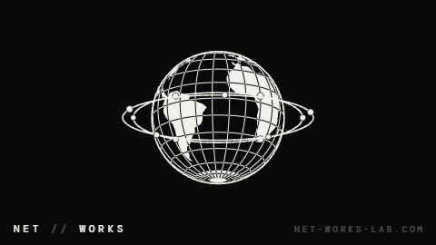 | **[Net Works Globe](#net-works-globe)** | A black and white low-polygon world turning inside two orbit rings. | [`networks-globe.zip`](https://github.com/Ringmast4r/Lively-Wallpapers/raw/main/packages/networks-globe.zip) |
| 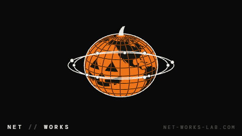 | **[Pumpkin Globe](#pumpkin-globe)** | The globe as a pumpkin with a carved face, flat or as a lit jack-o'-lantern. | [`pumpkin-globe.zip`](https://github.com/Ringmast4r/Lively-Wallpapers/raw/main/packages/pumpkin-globe.zip) |
| 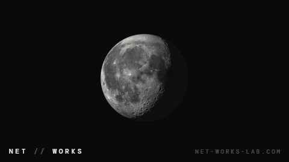 | **[Moon](#moon)** | The real lunar surface turning under a fixed light, craters and all. | [`moon.zip`](https://github.com/Ringmast4r/Lively-Wallpapers/raw/main/packages/moon.zip) |
| 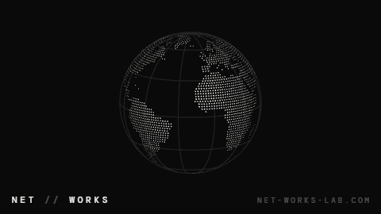 | **[Dot Matrix Globe](#dot-matrix-globe)** | No outlines: the continents as a lattice of dots that fade toward the limb. | [`dot-matrix-globe.zip`](https://github.com/Ringmast4r/Lively-Wallpapers/raw/main/packages/dot-matrix-globe.zip) |
| 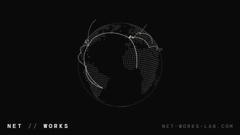 | **[Great Circles](#great-circles)** | Routes between cities arcing over a quiet dotted globe, each carrying a pulse. | [`great-circles.zip`](https://github.com/Ringmast4r/Lively-Wallpapers/raw/main/packages/great-circles.zip) |
| 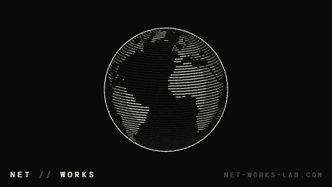 | **[Engraved Globe](#engraved-globe)** | Continents ruled out of parallels, the way a banknote builds a shape. | [`engraved-globe.zip`](https://github.com/Ringmast4r/Lively-Wallpapers/raw/main/packages/engraved-globe.zip) |
| 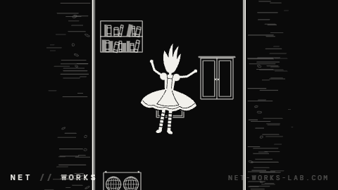 | **[Rabbit Hole](#rabbit-hole)** | A girl falling down a well lined with shelves, maps and cupboards, forever. | [`rabbit-hole.zip`](https://github.com/Ringmast4r/Lively-Wallpapers/raw/main/packages/rabbit-hole.zip) |

**Settings every wallpaper has** (right click the wallpaper in Lively, then Customise):

| Setting | Default | What it does |
|:--|:--|:--|
| Speed | `40` | Percent of full pace. `100` is one turn in 14 seconds; `40` is one in 35. `0` stops it, and a stopped wallpaper stops drawing. |
| Theme | Dark | Dark is ink on black, Light is ink on paper. |
| Corner wordmark | on | `NET // WORKS` bottom left and the line bottom right. |
| Right corner text | `NET-WORKS-LAB.COM` | Put anything you like there, or clear it. |

**Any screen.** Each one is sized from the shorter side of the monitor and drawn at the monitor's real pixel count, including at 125% and 150% Windows scaling. On screens wider than 16:9 the wordmark keeps to a centred 16:9 frame, so a taskbar docked to the side does not cover it.

---

<a id="net-works-globe"></a>
## `> net_works_globe`

<p align="center">
  
  
</p>

The Net // Works globe set in motion. The world turns east, eleven nodes travel the two rings and breathe, and the 15-degree graticule inverts wherever it crosses land so it reads over both. Everything runs on one clock, so slowing it down slows the whole scene instead of one part of it.

It is the still wallpaper from [net-works-lab.com](https://net-works-lab.com/downloads/) redrawn every frame: frozen on the same pose, the two match apart from edge antialiasing.

Its own setting: **Orbit rings** (on).

**What it costs.** Measured on a 5120x1440 monitor with an RTX 3070: Lively and its browser together used about 30% of one CPU core and 6 to 7% of the GPU. Lively pauses a wallpaper while a full-screen app or game is in front. The other five have not been measured.

---

<a id="pumpkin-globe"></a>
## `> pumpkin_globe`

<p align="center">
  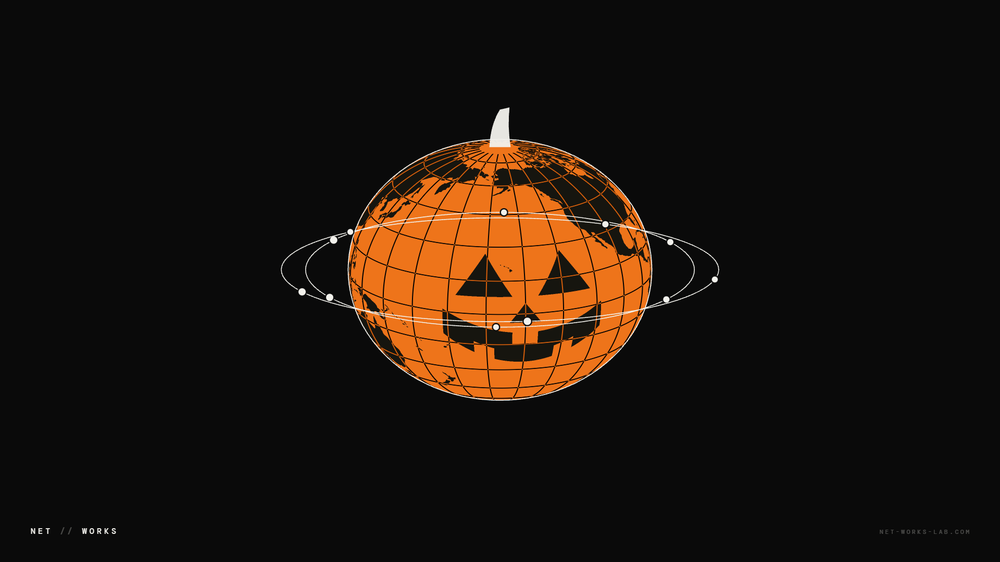
  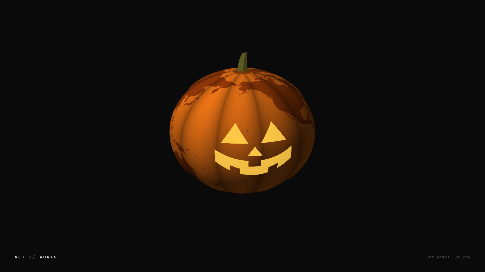
</p>

The globe the Net Works site wears every October. The face is carved into the open Pacific, where no land gets in its way, and turns with the body; the stem sits on the North Pole and its curl follows the spin.

Its own settings: **Look** (Pumpkin is the flat drawing with graticule and rings; Jack-o'-lantern is the same pumpkin shaded, with ten ribs and the face lit from inside) and **Orbit rings** (Pumpkin look only).

---

<a id="moon"></a>
## `> moon`

<p align="center">
  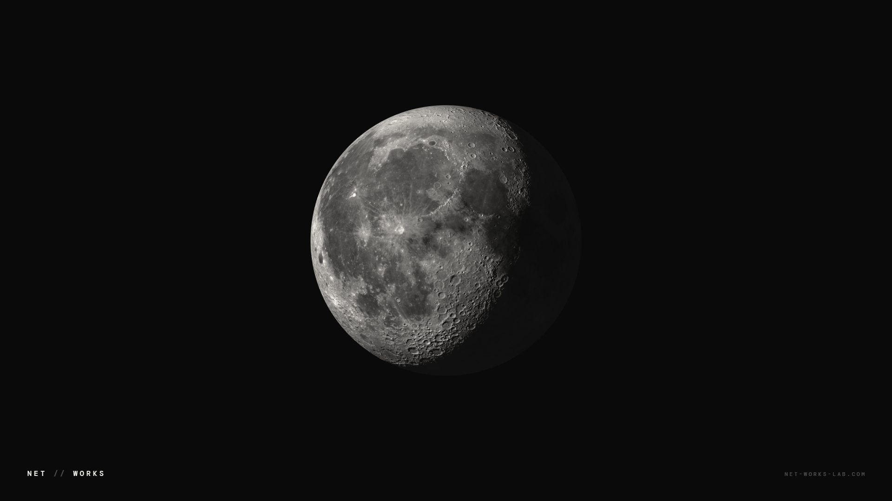
  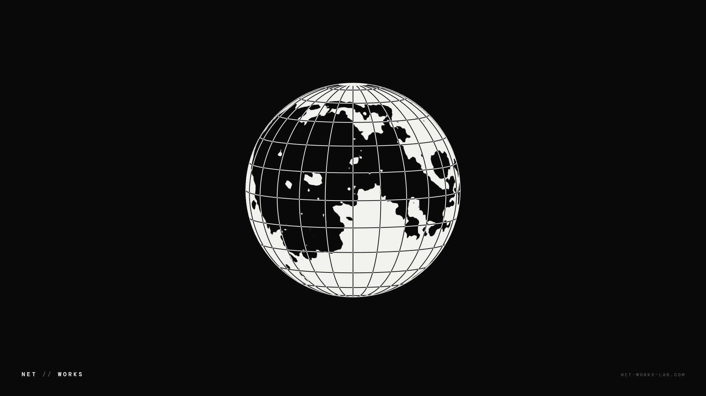
</p>

The real surface, from NASA's Lunar Reconnaissance Orbiter. The light is fixed to the screen and the Moon turns under it, so craters rise out of the dark at the terminator and flatten as they cross the lit face. That relief is not painted on: it is worked out from the laser altimeter's elevation model. Because it turns all the way round, you also get the far side, which nobody sees from Earth.

Its own settings: **Look** (Photograph, or Two-tone: the seas and highlands as two flat tones with the graticule, drawn the way the Net Works globe draws land and sea), **Sunlight angle** (`0` is a full Moon, `90` a half, default `55`) and **Orbit rings** (off).

---

<a id="dot-matrix-globe"></a>
## `> dot_matrix_globe`

<p align="center">
  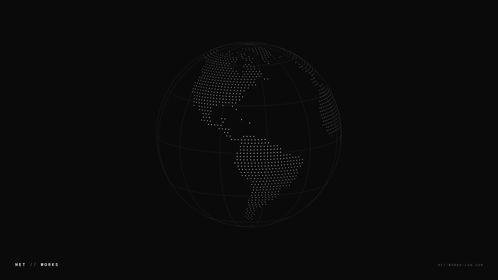
  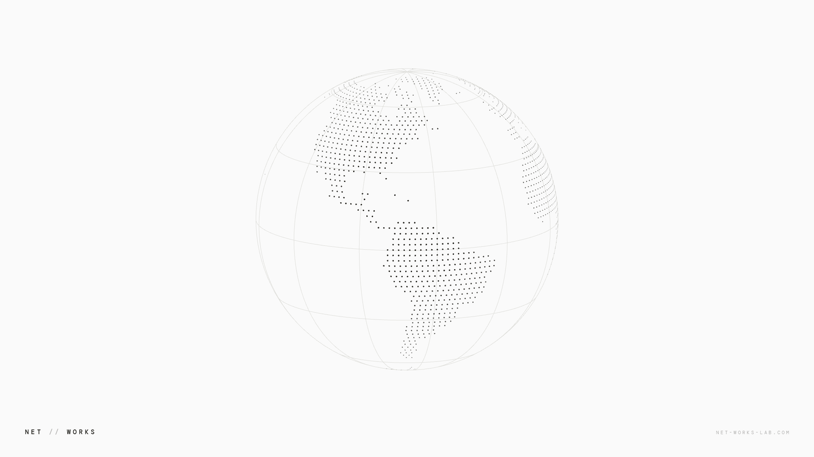
</p>

The coastline, resampled. Land is sampled on an equal-area lattice and every point becomes a dot that shrinks and fades as it turns away, so the sphere is described by density rather than by a drawn edge. Nothing is shaded.

Its own setting: **Graticule** (on).

---

<a id="great-circles"></a>
## `> great_circles`

<p align="center">
  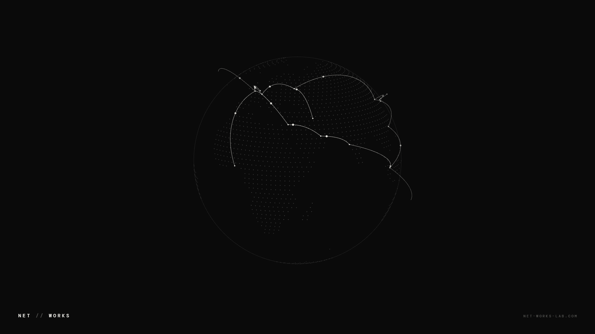
  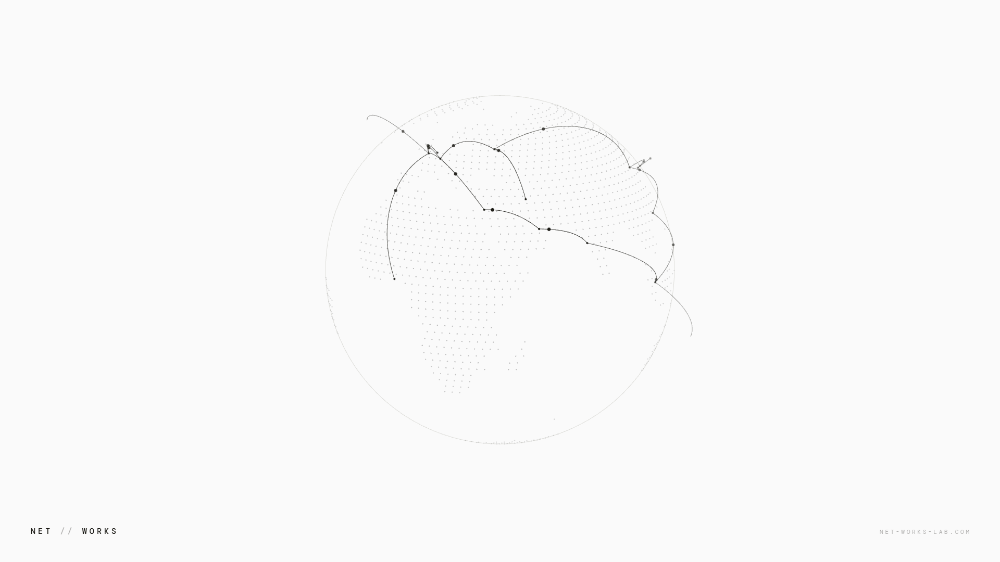
</p>

Routes, not places. Twenty-four real great circles between twenty-one cities, lifted off the surface so they arc over the limb, each carrying a pulse that dims as it turns away. The land is only a quiet silhouette of dots. The cities are real coordinates; the routes are a drawing, not traffic data.

---

<a id="engraved-globe"></a>
## `> engraved_globe`

<p align="center">
  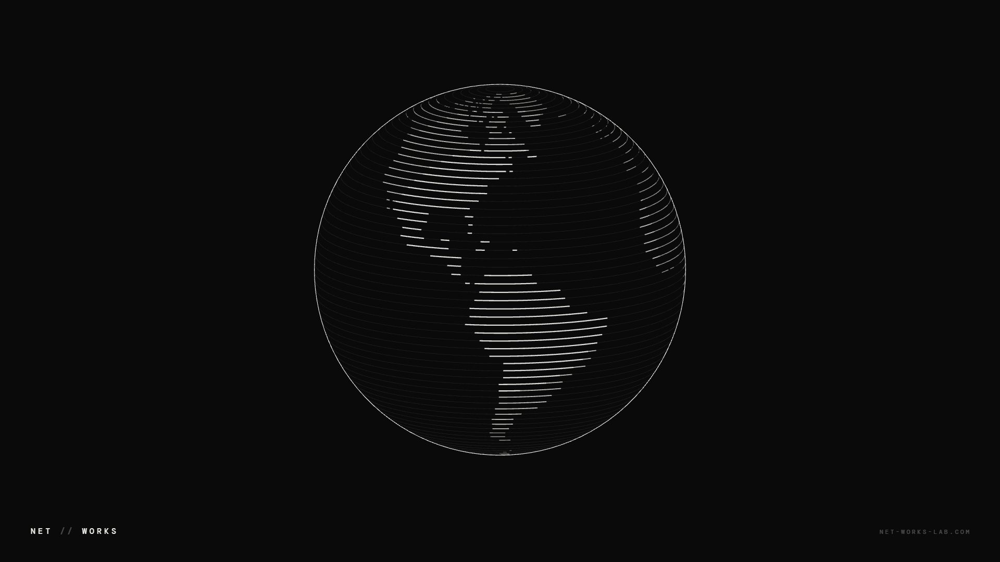
  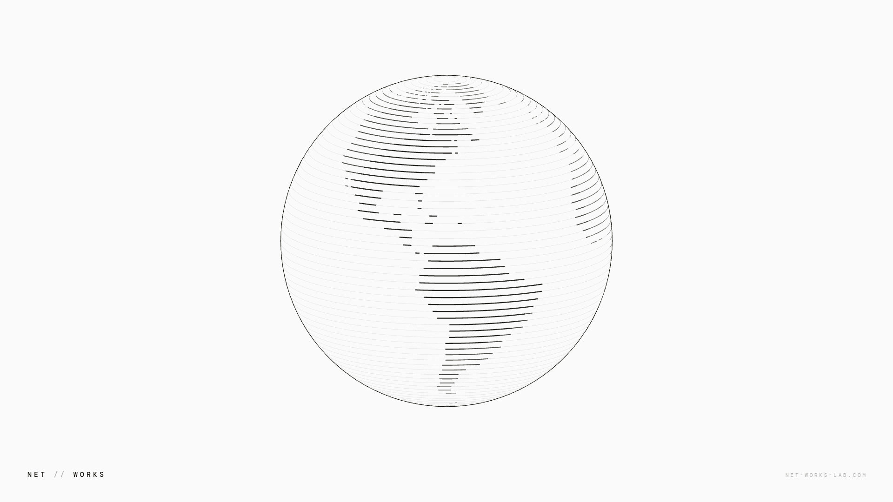
</p>

Continents made of parallels. One line per parallel, unbroken from limb to limb; where it crosses land it thickens, over water it stays a hairline. Nothing is filled and nothing is outlined. The continents appear because the ruling gets heavier.

---

<a id="rabbit-hole"></a>
## `> rabbit_hole`

<p align="center">
  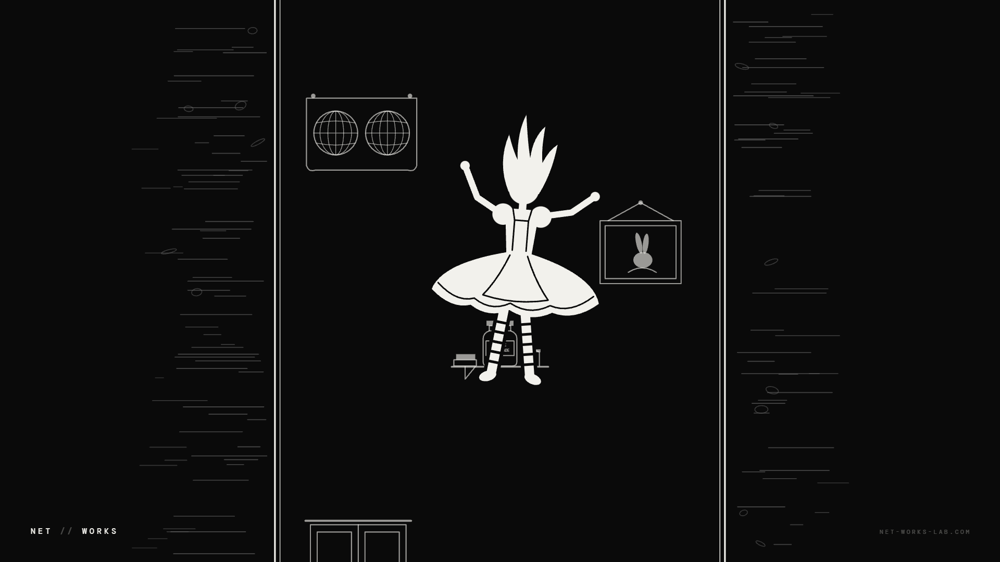
  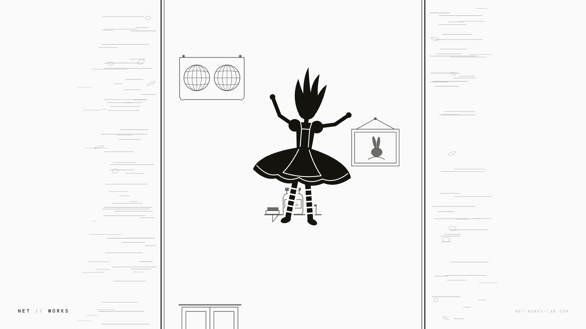
</p>

Down the rabbit hole, and never landing. This is our own ink drawing of the fall as Lewis Carroll's 1865 book describes it: a very deep well, a slow fall, and sides filled with cupboards and book-shelves, with maps and pictures hung upon pegs and a jar of marmalade on a shelf. Those drift up the back wall of the shaft while she sways in front of it, skirt and hair lifted by the air.

It loops without a seam. The wall is drawn once into a tall strip one period long, and her sway, skirt and hair all run on whole multiples of that period, so the last frame of a loop is its first. Here Speed sets the pace of the fall.

---

<a id="install"></a>
## `> install`

```
1.  Install Lively Wallpaper            winget install rocksdanister.LivelyWallpaper
2.  Download a zip from packages/       networks-globe.zip, moon.zip, ...
3.  Drag the zip onto the Lively window
4.  Click the wallpaper to set it; right click > Customise for its settings
```

Or install everything in this repo at once. Clone it, then:

```powershell
powershell -ExecutionPolicy Bypass -File install.ps1 -Restart
```

`install.ps1` copies each folder under `wallpapers/` into Lively's library and restarts Lively so they show up. It needs no admin rights and leaves the settings you have saved for a wallpaper alone.

Just want a look first? Open any `wallpapers/<name>/index.html` in a browser. It takes its settings from the query string: `?speed=100&theme=light&corner=HELLO`.

---

<a id="how-a-wallpaper-is-built"></a>
## `> how_a_wallpaper_is_built`

A Lively web wallpaper is a folder. No SDK and no build step.

```
wallpapers/pumpkin-globe/
  index.html               the wallpaper: its drawing, and nothing else
  nwlive.js                the kit all seven share: settings, layout, wordmark, clock, shader pieces
  land-110m.js             the real coastlines (the globes that use them)
  LivelyInfo.json          title, author, which file to open, thumbnail
  LivelyProperties.json    the settings panel: sliders, dropdowns, checkboxes, text boxes
  thumbnail.jpg            what Lively's library shows
  preview.gif              what it shows on hover
  fonts/                   DM Mono, shipped locally so nothing loads from the network
  LICENSE.txt              the terms the wallpaper is shared under
```

Lively hands each setting to the page by calling one function, once per setting on load and again whenever you change it:

```js
window.livelyPropertyListener = function (name, val) {
  if (name === 'speed') cfg.speed = +val;
  else if (name === 'theme') setTheme(+val === 1 ? 'light' : 'dark');
};
```

Things we learned building these:

- **Put the per-pixel work in a shader.** The globe, the pumpkin and the Moon are raycast in a WebGL2 fragment shader with their maps as textures, so the per-pixel work (up to four samples for every pixel of the disc, every frame, for as long as the desktop is up) runs on the GPU and not in a JavaScript loop.
- **Build the geometry once.** The dot, arc and ruled globes are canvas 2D. Every point is fixed on the sphere and only the viewer moves, so the unit vectors go into typed arrays once and a frame is a few multiplies per point, with no trigonometry and no allocation.
- **Repaint only what moves.** Each page is a few small canvases over a plain CSS background: the two corners of the wordmark (drawn once) and the globe's own box. When nothing has moved (Speed at 0), nothing is drawn at all.
- **Land every canvas on the device-pixel grid.** At 125% or 150% scaling a canvas whose CSS size is a hair off its pixel size gets resampled and the linework goes soft. The kit snaps each canvas edge to a pixel value that survives the conversion. See `gridDown` / `gridUp` in `nwlive.js`.
- **Ship data as script.** A page opened from disk may not read pixels out of an image file, but it may always run a script. The coastlines and the Moon's maps are `.js` files for that reason.

The repo's own plumbing:

```
shared/                    the one copy of nwlive.js, land-110m.js and the font
wallpapers.json            the list of wallpapers and what to shoot for each
scripts/build_lively_json.py   writes LivelyInfo.json and LivelyProperties.json
scripts/build_packages.py      copies shared/ into each folder, zips each into packages/
scripts/shoot.py               records the stills, thumbnails and previews from the real pages
scripts/build_land.py          Natural Earth GeoJSON -> shared/land-110m.js
scripts/build_moon.py          NASA's lunar maps -> wallpapers/moon/moon-data.js
```

---

<a id="stats"></a>
## `> stats --live`

<div align="center">

| METRIC | COUNT | NOTES |
|:------:|:-----:|:-----:|
| **Wallpapers** | `7` | Three drawn in a shader, four in canvas 2D |
| **Looks** | `9` | Pumpkin and Moon have two each; every one also comes in dark and light |
| **Network requests** | `0` | Fonts, coastlines and lunar maps are in the folder |
| **Libraries** | `0` | One shared kit of our own, no third-party code |
| **Package size** | `0.5 to 3.3 MB` | The Moon is the big one: it carries the lunar maps |

</div>

---

<a id="related-projects"></a>
## `> related_projects`

| Repo | What |
|:-----|:-----|
| [Ringmast4r/Rainmeter](https://github.com/Ringmast4r/Rainmeter) | The widgets that sit on top of these wallpapers: system, network and lab boards for Windows |
| [Ringmast4r/Conky](https://github.com/Ringmast4r/Conky) | The same idea for Linux desktops |
| [lively-community/lively](https://github.com/lively-community/lively) | Lively Wallpaper itself |

<a id="license"></a>
## `> license`

These wallpapers are proprietary to Net Works Lab LLC. Copyright (c) 2026 Net Works Lab LLC, all rights reserved.

You are welcome to download them and run them, unmodified, on your own devices for personal, non-commercial use. Redistributing, re-hosting, modifying or using them commercially needs written permission. The full terms are in [LICENSE](./LICENSE); this is not an open-source project.

The Rabbit Hole is an original drawing after Lewis Carroll's book of 1865, which is in the public domain. It takes nothing from any film or later illustration.

Three things inside belong to other people and keep their own terms:

- **DM Mono** (the `fonts/` folders) is under the SIL Open Font License; its text is beside it in `OFL.txt`.
- **The lunar maps** in `wallpapers/moon/moon-data.js` come from NASA's Scientific Visualization Studio [CGI Moon Kit](https://svs.gsfc.nasa.gov/4720) (Lunar Reconnaissance Orbiter). NASA imagery is in the public domain.
- **The coastlines** in `land-110m.js` come from [Natural Earth](https://www.naturalearthdata.com/), which is in the public domain.

**Maintained by** [@Ringmast4r](https://github.com/Ringmast4r)

<div align="center">


</div>
