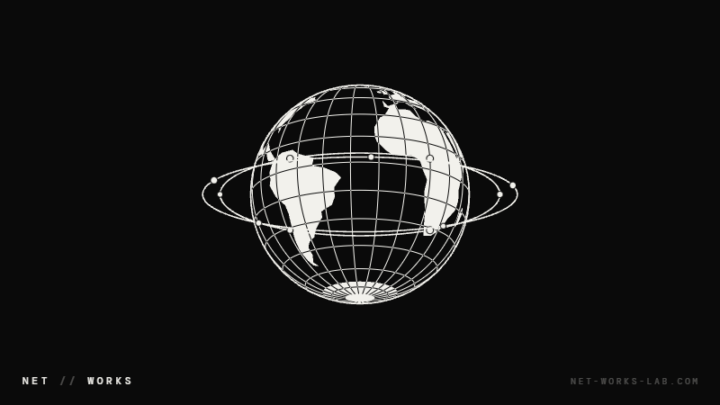
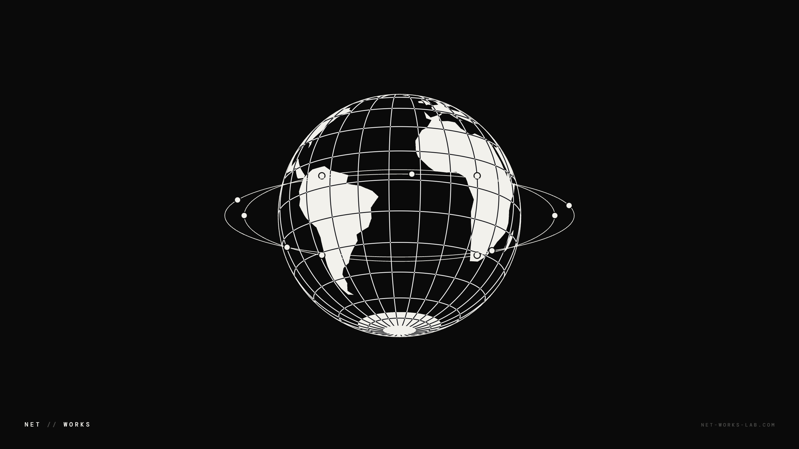
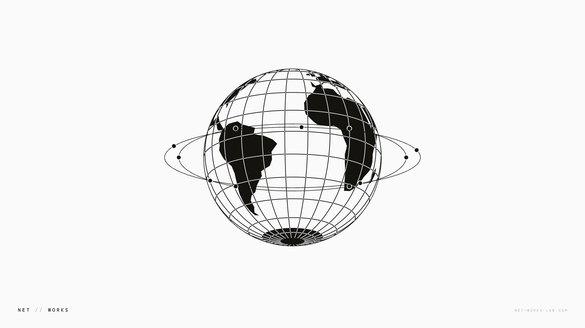

<div align="center">


`Windows` [`Lively Wallpaper`](https://github.com/lively-community/lively) `WebGL` `HTML` `Live Wallpaper` - Custom live wallpapers for Lively Wallpaper on Windows: plain HTML pages that draw on the GPU, each with its own settings panel. Widget counterpart: [Ringmast4r/Rainmeter](https://github.com/Ringmast4r/Rainmeter)

[](https://git.io/typing-svg)



<br>

[](#the-wallpapers)
[](https://github.com/lively-community/lively)
[](#how-a-wallpaper-is-built)
[](./LICENSE)

[](https://github.com/Ringmast4r/Lively-Wallpapers/stargazers)
[](https://github.com/Ringmast4r/Lively-Wallpapers/network/members)
[](#)
[](https://github.com/Ringmast4r/Lively-Wallpapers/commits/main)
[](#)

</div>

---

<a id="what-is-this"></a>
## `> what_is_this`

```bash
you@github:~$ cat lively-wallpapers.txt

  PURPOSE:        Live wallpapers we made for our own desktops, shared
  HOST:           Lively Wallpaper (free, open source, Windows 10 and 11)
  FORMAT:         One folder per wallpaper: index.html + two small JSON files
  NETWORK:        None. Fonts ship in the folder; nothing is fetched
  RIGHTS:         Proprietary to Net Works Lab LLC. Free to run, not to redistribute
  STATUS:         [ ACTIVE ]
```

> Windows has no live wallpaper of its own. [Lively Wallpaper](https://github.com/lively-community/lively) fills that gap by running a web page behind your desktop icons, and these are the pages.

The GIF above is the wallpaper itself, recorded by stepping the real page frame by frame (`scripts/shoot.py`). It is not a mock-up.

---

<a id="the-wallpapers"></a>
## `> ls wallpapers/`

| Wallpaper | What it is | Get it |
|:--|:--|:--|
| **[Net Works Globe](#net-works-globe)** | A black and white low-polygon world turning inside two orbit rings. Dark or light. | [`networks-globe.zip`](https://github.com/Ringmast4r/Lively-Wallpapers/raw/main/packages/networks-globe.zip) |

---

<a id="net-works-globe"></a>
## `> net_works_globe`

<p align="center">
  
  
</p>

The Net // Works globe set in motion. The world turns east, eleven nodes travel the two rings and breathe, and the 15-degree graticule inverts wherever it crosses land so it reads over both. Everything runs on one clock, so slowing it down slows the whole scene instead of one part of it.

It is the still wallpaper from [net-works-lab.com](https://net-works-lab.com/downloads/) redrawn every frame: frozen on the same pose, the two match apart from edge antialiasing.

**Settings** (right click the wallpaper in Lively, then Customise):

| Setting | Default | What it does |
|:--|:--|:--|
| Speed | `40` | Percent of full pace. `100` is one turn in 14 seconds; `40` is one in 35. `0` stops it. |
| Theme | Dark | Dark is ink on black, Light is ink on paper. |
| Orbit rings | on | The two rings and their nodes. |
| Corner wordmark | on | `NET // WORKS` bottom left and the line bottom right. |
| Right corner text | `NET-WORKS-LAB.COM` | Put anything you like there, or clear it. |

**Any screen.** The globe is sized from the shorter side of the monitor and drawn at the monitor's real pixel count, including at 125% and 150% Windows scaling. On screens wider than 16:9 the wordmark keeps to a centred 16:9 frame, so a taskbar docked to the side does not cover it.

**What it costs.** Measured on a 5120x1440 monitor with an RTX 3070: Lively and its browser together used about 30% of one CPU core and 6 to 7% of the GPU. Lively pauses the wallpaper while a full-screen app or game is in front.

---

<a id="install"></a>
## `> install`

```
1.  Install Lively Wallpaper            winget install rocksdanister.LivelyWallpaper
2.  Download a zip from packages/       networks-globe.zip
3.  Drag the zip onto the Lively window
4.  Click the wallpaper to set it; right click > Customise for its settings
```

Or install everything in this repo at once. Clone it, then:

```powershell
powershell -ExecutionPolicy Bypass -File install.ps1 -Restart
```

`install.ps1` copies each folder under `wallpapers/` into Lively's library and restarts Lively so they show up. It needs no admin rights and leaves the settings you have saved for a wallpaper alone.

Just want a look first? Open `wallpapers/networks-globe/index.html` in a browser. It takes its settings from the query string: `?speed=100&theme=light&orbits=0&corner=HELLO`.

---

<a id="how-a-wallpaper-is-built"></a>
## `> how_a_wallpaper_is_built`

A Lively web wallpaper is a folder. No SDK and no build step.

```
wallpapers/networks-globe/
  index.html               the wallpaper: one page, no dependencies
  LivelyInfo.json          title, author, which file to open, thumbnail
  LivelyProperties.json    the settings panel: sliders, dropdowns, checkboxes, text boxes
  thumbnail.jpg            what Lively's library shows
  preview.gif              what it shows on hover
  fonts/                   DM Mono, shipped locally so nothing loads from the network
  LICENSE.txt              the terms the wallpaper is shared under
```

Lively hands each setting to the page by calling one function, once per setting on load and again whenever you change it:

```js
window.livelyPropertyListener = function (name, val) {
  if (name === 'speed') cfg.speed = +val;
  else if (name === 'theme') setTheme(+val === 1 ? 'light' : 'dark');
};
```

Three things we learned building the globe:

- **Put the per-pixel work in a shader.** The globe is raycast in a WebGL2 fragment shader with the land mask as a texture, so the per-pixel work (four samples for every pixel of the disc, every frame, for as long as the desktop is up) runs on the GPU and not in a JavaScript loop.
- **Repaint only what moves.** The page is four small canvases over a plain CSS background: the two corners of the wordmark (drawn once), the globe, and the rings. A frame touches the globe's box and nothing else.
- **Land every canvas on the device-pixel grid.** At 125% or 150% scaling a canvas whose CSS size is a hair off its pixel size gets resampled and the linework goes soft. The page snaps each canvas edge to a pixel value that survives the conversion. See `gridDown` / `gridUp` in `index.html`.

Adding a wallpaper to this repo: make a folder under `wallpapers/` with those files, run `py -3.13 scripts/build_packages.py` to zip it into `packages/`, and add its row to the table above.

---

<a id="stats"></a>
## `> stats --live`

<div align="center">

| METRIC | COUNT | NOTES |
|:------:|:-----:|:-----:|
| **Wallpapers** | `1` | Net Works Globe |
| **Settings** | `5` | Speed, theme, rings, wordmark, corner text |
| **Network requests** | `0` | Fonts and code are in the folder |
| **Dependencies** | `0` | One HTML file, no libraries |
| **Package size** | `783 KB` | Most of it is the hover preview |

</div>

---

<a id="related-projects"></a>
## `> related_projects`

| Repo | What |
|:-----|:-----|
| [Ringmast4r/Rainmeter](https://github.com/Ringmast4r/Rainmeter) | The widgets that sit on top of these wallpapers: system, network and lab boards for Windows |
| [Ringmast4r/Conky](https://github.com/Ringmast4r/Conky) | The same idea for Linux desktops |
| [lively-community/lively](https://github.com/lively-community/lively) | Lively Wallpaper itself |

<a id="license"></a>
## `> license`

These wallpapers are proprietary to Net Works Lab LLC. Copyright (c) 2026 Net Works Lab LLC, all rights reserved.

You are welcome to download them and run them, unmodified, on your own devices for personal, non-commercial use. Redistributing, re-hosting, modifying or using them commercially needs written permission. The full terms are in [LICENSE](./LICENSE); this is not an open-source project.

The DM Mono font in `wallpapers/networks-globe/fonts/` is the one exception: it belongs to its own authors and stays under the SIL Open Font License, whose text is beside it in `OFL.txt`.

**Maintained by** [@Ringmast4r](https://github.com/Ringmast4r)

<div align="center">


</div>
